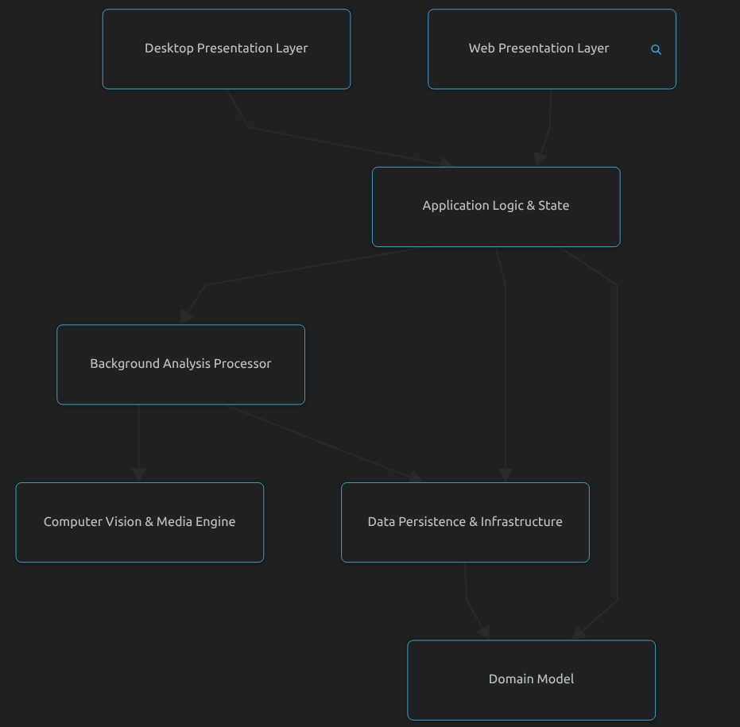
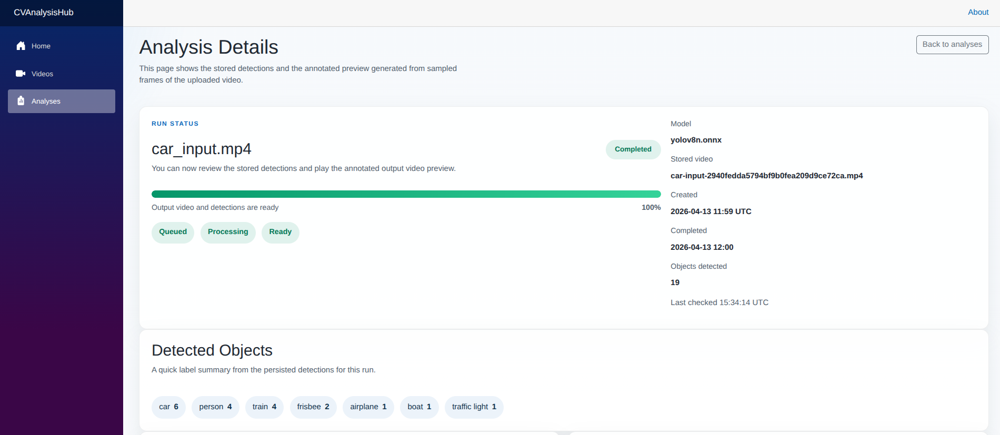
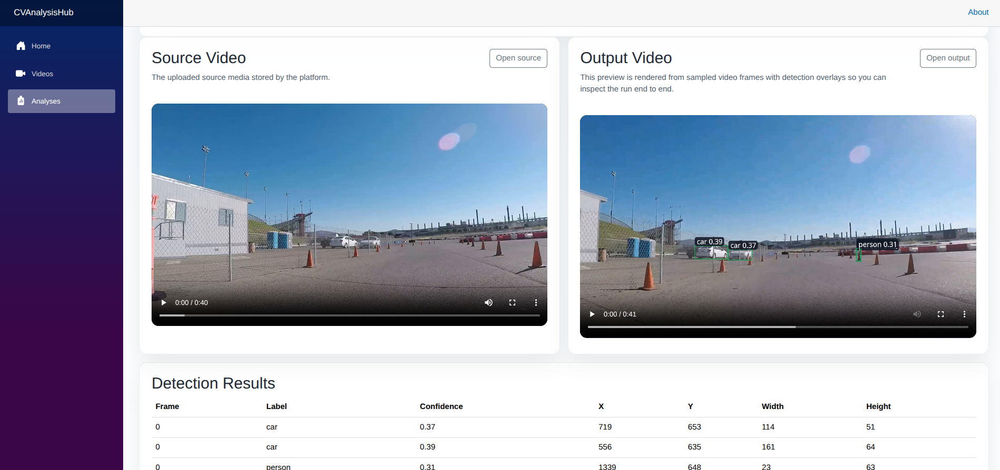
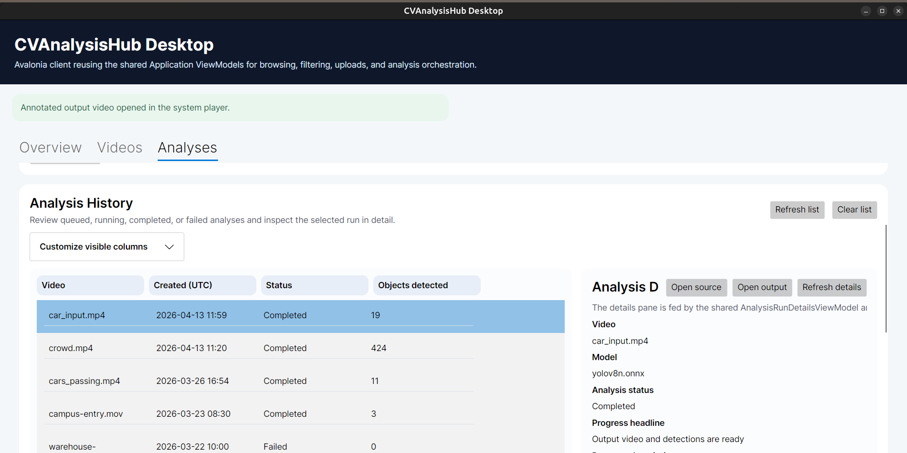
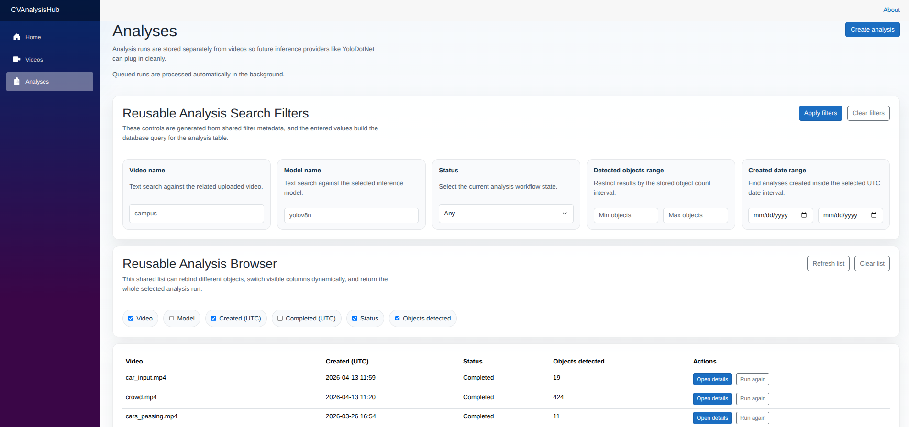
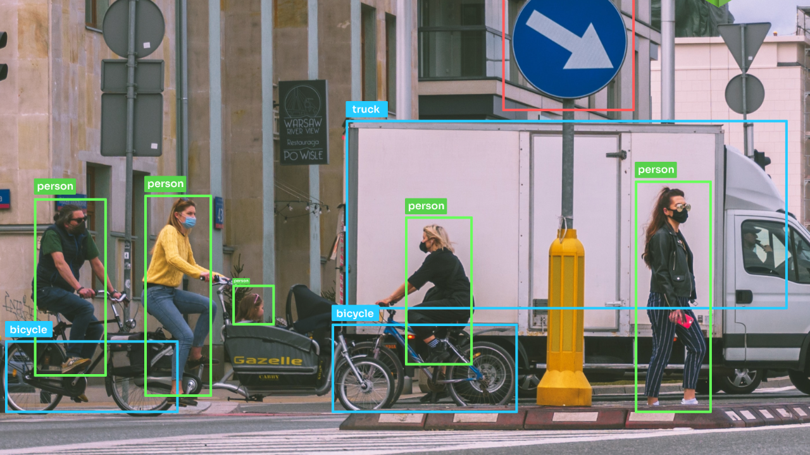

# CVAnalysisHub

A .NET course project that combines MVVM, two UI technologies, two database providers, reusable UI abstractions, and real video object detection.

The application allows users to upload videos, queue analysis runs, process them with a YOLO model, and inspect the detected objects through both a web client and a desktop client.

## Overview

This project was built for a university practical project of my course called `Програмни Среди`. Its main goal is to demonstrate:

- MVVM with shared ViewModels
- two different UI technologies using the same application layer
- one model/business layer working with both SQLite and PostgreSQL
- reusable search filters for multiple data models
- reusable object-list rendering and selection
- real video analysis with YOLO-based object detection

## Tech Stack

- `.NET 10`
- `Blazor` for the web UI
- `Avalonia` for the desktop UI
- `Entity Framework Core`
- `SQLite` and `PostgreSQL`
- `YoloDotNet` with `ONNX Runtime`
- `ffmpeg` for frame extraction and annotated video generation

## Key Features

- Upload source videos into a shared media library
- Create and track analysis runs
- Process queued jobs in the background
- Detect objects from sampled video frames
- Generate annotated output videos
- Inspect detected objects, statuses, and run details
- Use shared filtering and shared object-list components across multiple screens
- Run the same application logic from both Blazor and Avalonia

## Architecture

The solution follows a layered structure:

- `CVAnalysisHub.Core`
  Domain entities and core business data
- `CVAnalysisHub.Application`
  Shared ViewModels, DTOs, requests, filter abstractions, object-list abstractions
- `CVAnalysisHub.Infrastructure`
  EF Core persistence, media services, YOLO integration, background processing
- `CVAnalysisHub.Web`
  Blazor UI
- `CVAnalysisHub.Avalonia`
  Avalonia desktop UI

The project uses MVVM on the presentation side, but in a realistic layered architecture rather than a single-project `Models / Views / ViewModels` folder layout.

## External Architecture View

The repository was also summarized with [CodeBoarding](https://github.com/CodeBoarding/CodeBoarding), an external architecture-mapping tool that helps with fast repository onboarding. Its high-level view of `CVAnalysisHub` is useful as a compact visual summary of the two presentation clients, the shared application logic, the background analysis processor, the media engine, the persistence layer, and the domain model.



CodeBoarding identifies the following major areas of the project:

- `Application Logic & State`: shared ViewModels, service abstractions, and UI-facing orchestration.
- `Background Analysis Processor`: hosted background execution for queued analysis jobs.
- `Web Presentation Layer`: the `Blazor` client.
- `Desktop Presentation Layer`: the `Avalonia` client.
- `Computer Vision & Media Engine`: frame extraction, video processing, and YOLO-based detection.
- `Data Persistence & Infrastructure`: EF Core services, storage, and provider-specific persistence.
- `Domain Model`: core business entities such as videos, analysis runs, and detection results.

## Screenshots

### Blazor Analysis View




### Avalonia Desktop View



### Reusable Filters and Object List



### Object Detection Example



## Database Support

The same infrastructure layer supports both database providers:

- `SQLite`
- `PostgreSQL`

Provider selection is configuration-driven through `Persistence:Provider`.

## Configuration Notes

Both UI clients use the same style of configuration:

- `ConnectionStrings:Sqlite`
- `ConnectionStrings:PostgreSql`
- `MediaStorage:RootPath`
- `VideoProcessing:FfmpegPath`
- `ComputerVision:YoloDotNet:ModelPath`

The repository ships with relative default paths for local project data:

- `App_Data/cvanalysishub.shared.db`
- `App_Data/media`
- `App_Data/models/yolov8n.onnx`

You should update the PostgreSQL connection string, model path, and ffmpeg path if your environment is different.

## Running the Project

### Web

Run the Blazor application from `CVAnalysisHub.Web`.

### Desktop

Run the Avalonia application from `CVAnalysisHub.Avalonia`.

## Documentation

The LaTeX project documentation is stored in:

- `documentation/`

The latest generated PDF is:

- [`documentation/build/main.pdf`](documentation/build/main.pdf)

## Repository Structure

```text
CVAnalysisHub/
├── CVAnalysisHub.Application/
├── CVAnalysisHub.Avalonia/
├── CVAnalysisHub.Core/
├── CVAnalysisHub.Infrastructure/
├── CVAnalysisHub.Web/
├── documentation/
└── docs/
```

## Project Status

The current version demonstrates the following:

- shared MVVM ViewModels across two UI technologies
- two supported DBMS providers
- reusable search filters for multiple models
- reusable object-list rendering and selection for multiple models
- end-to-end video analysis with YOLO object detection
